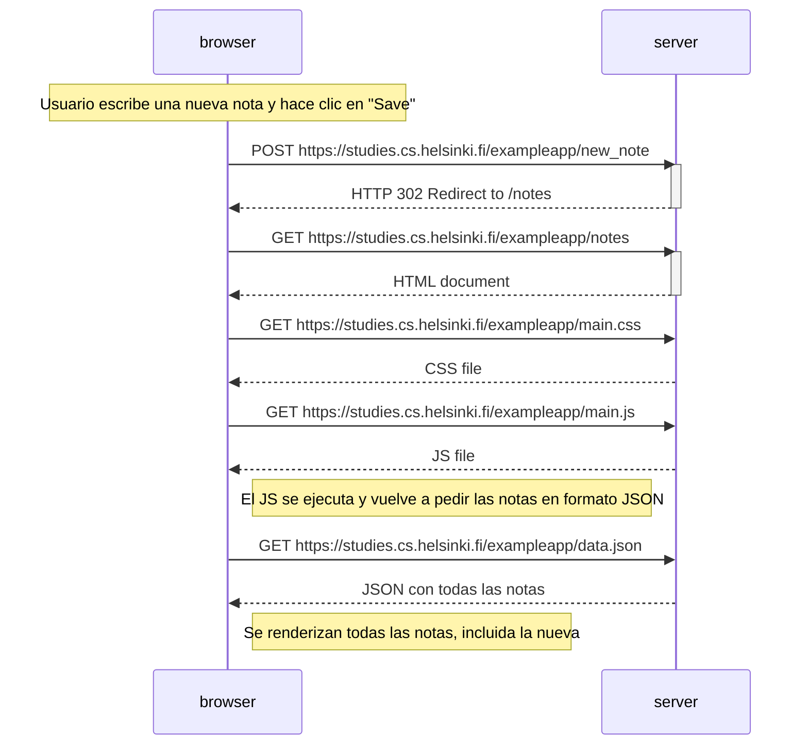
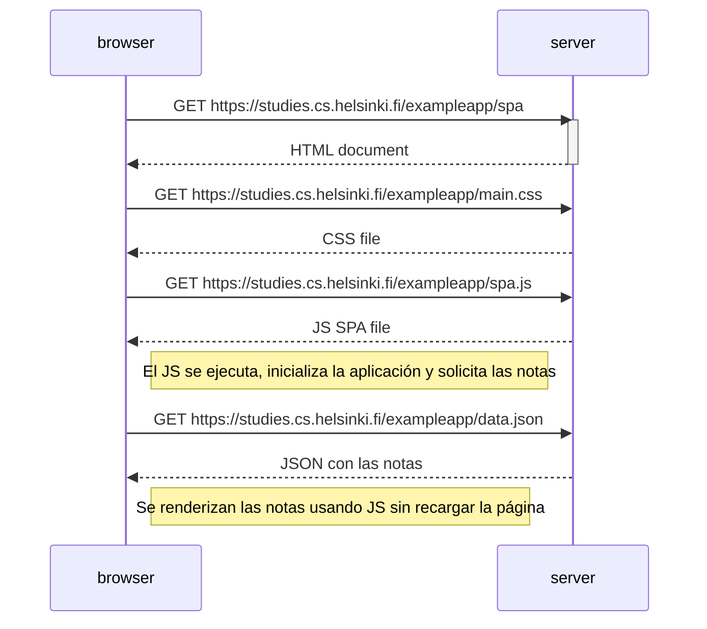
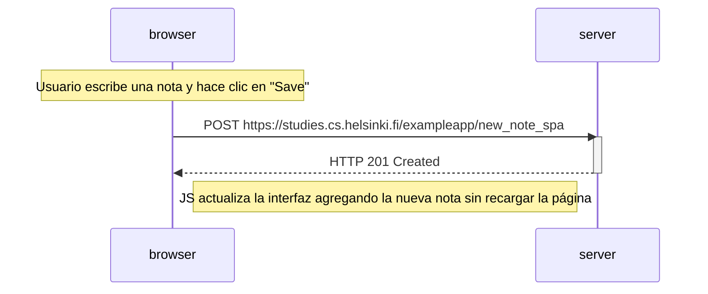

# Diagramas para ejercicios 0.4, 0.5 y 0.6

## 0.4: Nueva nota en `/notes`

```mermaid
sequenceDiagram
    participant browser
    participant server

    Note over browser: Usuario escribe una nueva nota y hace clic en "Save"

    browser->>server: POST https://studies.cs.helsinki.fi/exampleapp/new_note
    activate server
    server-->>browser: HTTP 302 Redirect to /notes
    deactivate server

    browser->>server: GET https://studies.cs.helsinki.fi/exampleapp/notes
    activate server
    server-->>browser: HTML document
    deactivate server

    browser->>server: GET https://studies.cs.helsinki.fi/exampleapp/main.css
    server-->>browser: CSS file

    browser->>server: GET https://studies.cs.helsinki.fi/exampleapp/main.js
    server-->>browser: JS file

    Note right of browser: El JS se ejecuta y vuelve a pedir las notas en formato JSON

    browser->>server: GET https://studies.cs.helsinki.fi/exampleapp/data.json
    server-->>browser: JSON con todas las notas

    Note right of browser: Se renderizan todas las notas, incluida la nueva
```

## 0.5: Carga de la aplicación SPA (`/spa`)

```mermaid
sequenceDiagram
    participant browser
    participant server

    browser->>server: GET https://studies.cs.helsinki.fi/exampleapp/spa
    activate server
    server-->>browser: HTML document
    deactivate server

    browser->>server: GET https://studies.cs.helsinki.fi/exampleapp/main.css
    server-->>browser: CSS file

    browser->>server: GET https://studies.cs.helsinki.fi/exampleapp/spa.js
    server-->>browser: JS SPA file

    Note right of browser: El JS se ejecuta, inicializa la aplicación y solicita las notas

    browser->>server: GET https://studies.cs.helsinki.fi/exampleapp/data.json
    server-->>browser: JSON con las notas

    Note right of browser: Se renderizan las notas usando JS sin recargar la página
```

## 0.6: Nueva nota en versión SPA

```mermaid
sequenceDiagram
    participant browser
    participant server

    Note over browser: Usuario escribe una nota y hace clic en "Save"

    browser->>server: POST https://studies.cs.helsinki.fi/exampleapp/new_note_spa
    activate server
    server-->>browser: HTTP 201 Created
    deactivate server

    Note right of browser: JS actualiza la interfaz agregando la nueva nota sin recargar la página
```